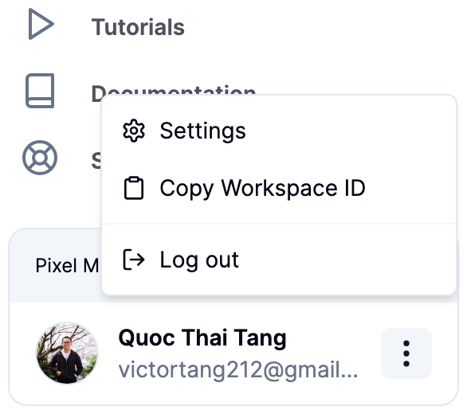

# AgenticFlow Boilerplate

Welcome to the AgenticFlow boilerplate! This guide will help you set up and start using the boilerplate quickly.

## Getting Started

Follow these steps to get your development environment set up:

### 1. Install Dependencies

First, you need to install the necessary dependencies. Run the following command in your terminal:

```bash
npm i
```

### 2. Setup Environment

Next, set up your environment variables. Create a `.env` file in the root directory and add the following lines, replacing XXX with your actual values:

```text
NEXT_PUBLIC_API_BASE_URL=https://api.workflowchef.ai
AGENTICFLOW_API_KEY=XXX
AGENTICFLOW_TEAMSPACE_ID=XXX
```

To obtain the `TEAMSPACE_ID`, click on the `Copy Workspace ID` button as shown in the image below:



To retrieve the `API_KEY`, visit the following URL: [AgenticFlow Settings](https://app.agenticflow.ai/settings).

### 3. Start The Development Server

Once the dependencies are installed and the environment variables are set, you can start the preview server by running:

```bash
npm run dev
```

This command will start the development server, allowing you to preview your project in the browser.

### 4. Preview a Specific Workflow

To preview a specific workflow, navigate to the following URL in your web browser:

```text
http://localhost:3000/workflows/<workflow_id>
```

Replace `<workflow_id>` with the actual ID of the workflow you wish to preview.
